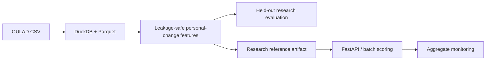

# LearnPulse AI

> Research prototype only. LearnPulse predicts future recorded OULAD VLE inactivity; it does not diagnose disengagement and must not drive automatic learner decisions.

LearnPulse asks whether a learner's recent behavior, compared with that same learner's earlier activity, helps predict **no recorded OULAD VLE activity during the next 14 course days**. The system processes 10.7 million raw activity records into 1.8 million daily summaries and 107,147 eligible observations across 22 module-presentations and 24,738 student identifiers.

Held-out experiments found that personal-change features generalized better than absolute-only activity on several priority metrics, while performance varied materially across courses. A retrospective capacity simulation showed that reducing review workload can also lose true alerts and support time. Neither result establishes causation or deployment readiness.

LearnPulse AI is a streaming learning-analytics research project built from the
real Open University Learning Analytics Dataset (OULAD).

## Dataset

OULAD contains anonymized information about 32,593 students and their activity
in the Open University's Virtual Learning Environment. The project uses the
official UCI copy of the dataset under the CC BY 4.0 license.

The `studentVle.csv` table does not contain second-by-second clicks. Each row is
a daily summary: a student, a learning resource, the day relative to the course
start, and the number of clicks. LearnPulse replays these honest daily records
instead of inventing timestamps.

Dataset citation:

> Kuzilek, J., Hlosta, M., & Zdrahal, Z. (2015). Open University Learning
> Analytics dataset. UCI Machine Learning Repository.
> https://doi.org/10.24432/C5KK69

## Open in VS Code

1. Open the `learnpulse-ai` folder in VS Code.
2. Select a Python 3.10+ interpreter.
3. Open the integrated terminal.
4. Run the commands below.

Inspect the real tables:

```bash
python scripts/inspect_data.py
```

Replay 20 real records from module AAA, presentation 2013J:

```bash
python -m learnpulse.cli --module AAA --presentation 2013J --limit 20
```

Slow the replay so each record appears separately:

```bash
python -m learnpulse.cli --module AAA --presentation 2013J --limit 20 --delay 0.25
```

Run the tests:

```bash
python -m unittest discover -s tests -v
```

## Production-style research interface



Install with `pip install -r requirements.txt`, run all tests with `python -m unittest discover -s tests -v`, and build the reproducible reference artifact with:

```powershell
python -m learnpulse.reference_model_cli --modeling-table data/processed/multicourse_modeling_table.parquet --artifact-dir artifacts/reference_model --folds 5 --random-seed 42 --model-version 1.0.0
python -m uvicorn learnpulse.scoring_api:app --host 127.0.0.1 --port 8000
```

Batch and monitoring help are available through `python -m learnpulse.batch_scoring_cli --help` and `python -m learnpulse.monitoring_cli --help`. Docker: `docker compose up --build`. See [architecture](docs/architecture.md), [API](docs/api.md), [monitoring](docs/monitoring.md), [reproducibility](docs/reproducibility.md), and the [case study](docs/portfolio_case_study.md).

Generated raw data, restricted predictions, student-level outputs, and model binaries are intentionally excluded from the public release. OULAD is not distributed with this repository. Obtain OULAD from its authorized source and follow its applicable terms.

## Research design

The pipeline creates daily summaries, complete seven-day rolling windows, and personal baselines using only earlier complete windows. Future outcomes, withdrawal information, final results, demographics and identifiers are excluded from model features. Evaluation groups rows by student and holds out entire presentations or modules; strict analyses also remove overlapping learners from training.

The selected personal-change schema contains ten historical/deviation features. Sigmoid calibration and threshold policies are fitted using grouped training OOF scores. Scores are not invariant risk percentages, and threshold policies are descriptive research choices.

## Key findings and limitations

- Day 28 was the earliest reasonably useful checkpoint in the original timing study; later checkpoints can improve some metrics but reduce available support time.
- Personal-change behavior outperformed absolute-only features on several grouped and cross-course measures, but no result supports universal course transfer.
- Calibration, subgroup, temporal and workload results show substantial uncertainty and operational trade-offs.
- Fairness auditing reports measured disparities with suppression and course adjustment; it does not label the model universally fair or biased.
- No learner received an intervention, so the project cannot estimate educational benefit.

Quantitative claims and their source artifacts are indexed in [docs/results_index.md](docs/results_index.md).

## Workload dashboard

Run the aggregate-only dashboard locally:

```powershell
streamlit run learnpulse/workload_dashboard.py
```

It does not load case-level files by default and must not be used for automatic decisions.

## Repository structure

| Path | Purpose |
|---|---|
| `learnpulse/` | Feature, evaluation, service and audit code |
| `tests/` | Synthetic and optional real-data tests |
| `research/` | Detailed scientific methods |
| `docs/` | Architecture, API, monitoring and release documentation |
| `portfolio/` | Recruiter, interview and research summaries |
| `config/` | Research model and monitoring configuration |
| `experiments/` | Generated aggregate reports; restricted outputs are ignored |

## Reproducibility and release audit

```powershell
python -m unittest discover -s tests -v
python -m compileall learnpulse
python -m learnpulse.release_audit_cli --repository .
python -m learnpulse.task_cli api-smoke-test
```

See [reproducibility](docs/reproducibility.md), [command reference](docs/command_reference.md), and the [final technical report](docs/LearnPulse_Final_Technical_Report.md).

## Privacy, ethics, citation and data access

The API rejects demographics, identifiers, outcomes and future fields. Restricted predictions, student-level files, raw data, and demographic records are excluded from public packaging; logs omit payloads, and human review is required. See [privacy and security](docs/privacy_and_security.md), [data access](docs/data_access.md), and [citation metadata](CITATION.cff).

LearnPulse source code is licensed under the [MIT License](LICENSE). That software license does **not** grant permission to redistribute OULAD. Users must obtain OULAD from its authorized source and comply with its applicable terms.

## Historical project boundary

This checkpoint only reads and replays real data. It does not calculate a risk
score yet. The next checkpoint will aggregate recent activity per student.
