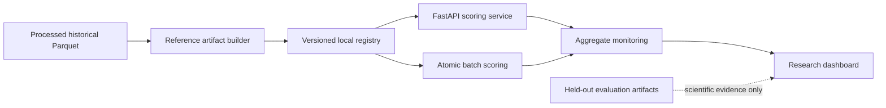

# Architecture

```mermaid
flowchart LR
  A[Processed historical Parquet] --> B[Reference artifact builder]
  B --> C[Versioned local registry]
  C --> D[FastAPI scoring service]
  C --> E[Atomic batch scoring]
  D --> F[Aggregate monitoring]
  E --> F
  F --> G[Research dashboard]
  H[Held-out evaluation artifacts] -. scientific evidence only .-> G
```

The full-data reference artifact demonstrates inference engineering. It is distinct from immutable held-out evaluation artifacts and retrospective workload artifacts.
